# **Pros-and-cons of Confluence, Jira and Flare documentation**

# Confluence  
When I googled "Confluence documentation" the search took me to [Confluence Documentation Directory](https://confluence.atlassian.com/alldoc/confluence-documentation-directory-12877996.html) where one can find the documentation for all versions of the software, including the latest one: 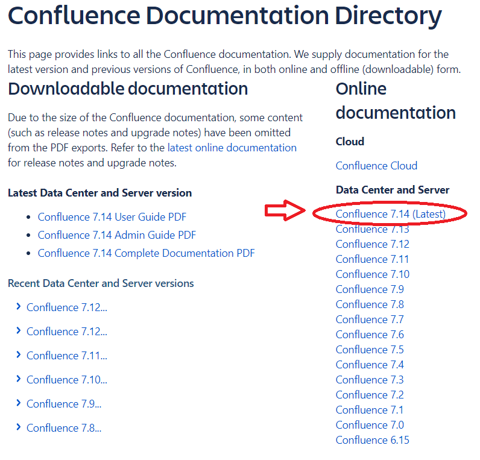 For a logged-in user, navigating to the Confluence documentation should not be a problem either: 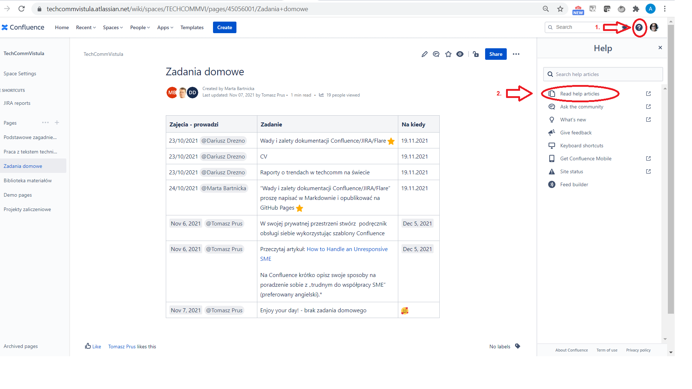

**Confluence - Pros**
1. Rather easy to find
2. You can click on and enlarge the images in the documentation, e.g. [here](https://confluence.atlassian.com/doc/create-your-personal-space-777010869.html)
3. Informative yet funny tutorials in the Get Started section of the documentation: [Navigate Confluence](https://confluence.atlassian.com/doc/tutorial-navigate-confluence-251005338.html)  and [Space Ace](https://confluence.atlassian.com/doc/tutorial-space-ace-777010865.html) - I loved the aeronautics references
4. Informal language, e.g. *Enough about that; let's begin.* [here](https://confluence.atlassian.com/doc/tutorial-space-ace-777010865.html)

**Confluence - Cons** 
1. The **Next** button is all blue unless you hover your mouse over it: 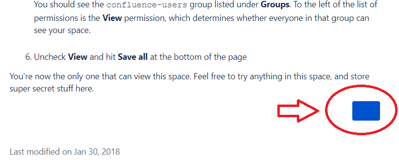
2. On some pages, you are unable to enlarge the images, e.g. [here](https://confluence.atlassian.com/doc/keyboard-shortcuts-139456.html)
3. Some articles are a little bit too wordy, I would definitely try to make them shorter, e.g. [here](https://confluence.atlassian.com/doc/develop-technical-documentation-in-confluence-226166494.html)

# Jira
Jira documentation is pretty easy to find. At first, I simply googled "Jira documentation" and there it was, as the first hit. It's also rather uncomplicated to find when you are a logged-in Jira user: 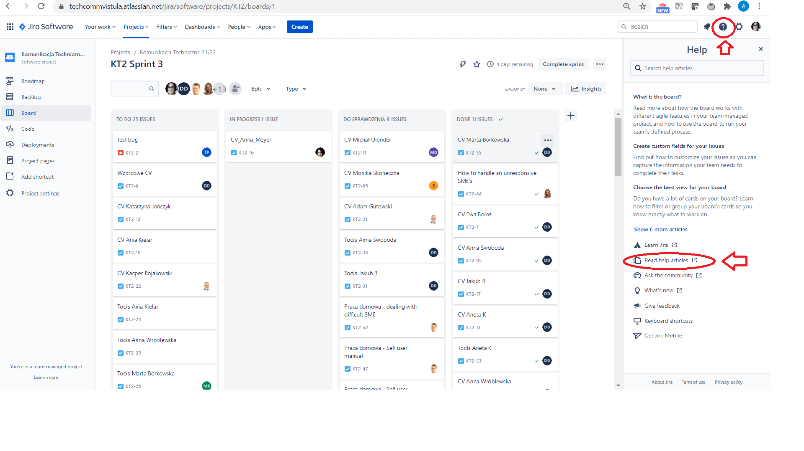

**Jira - Pros**

 1. Easy to find
 2. **Search** option available: 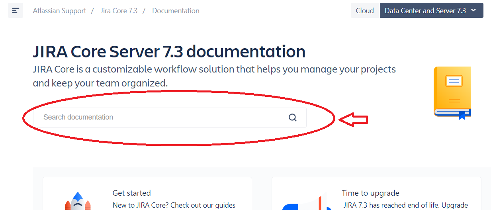
 3. Informal language, e.g. *Ready to get going? Let's start with grabbing the installer.* [here](https://confluence.atlassian.com/jiracoreserver073/setting-up-your-instance-861255641.html#Settingupyourinstance-Downloadtheinstaller)
 4. Good-sized images within the text: 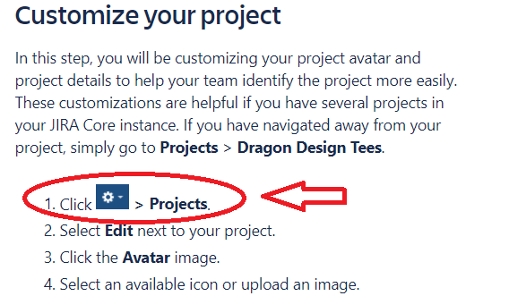 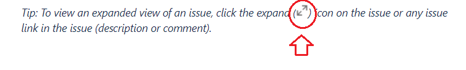
 5. There's a link to the Atlassian Community on every page: 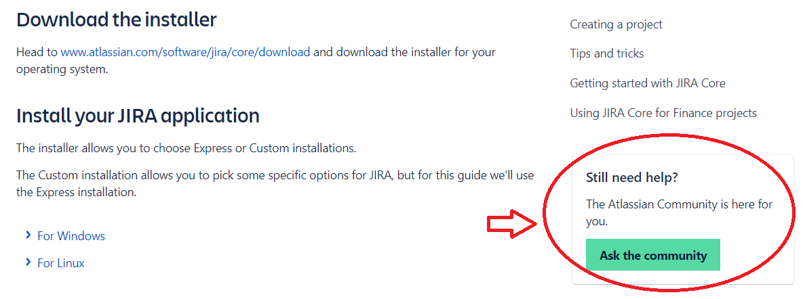
 6. When you are reading a topic, there is **Related content** available on the right side of the article: 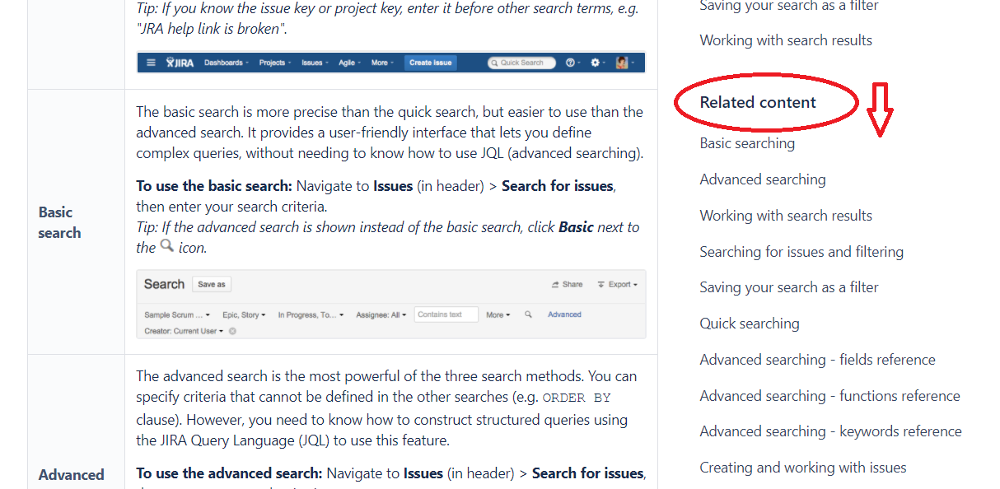
 7. Nice-looking, simple font

**Jira - Cons**
1. **Let's get started**, **Next** buttons - unreadable, wrong choice of colors: 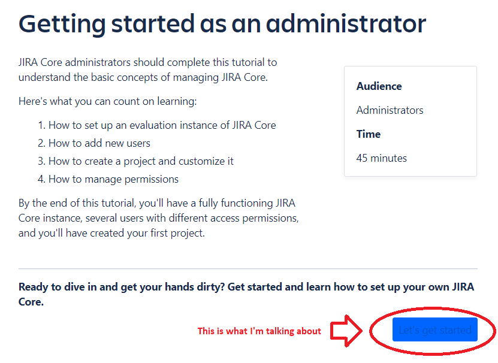 
2. In Chrome, you are unable to click on an image and enlarge it, e.g. [here](https://confluence.atlassian.com/jiracoreserver073/managing-permissions-861255652.html) or [here](https://confluence.atlassian.com/jiracoreserver/viewing-a-project-938846234.html)
3. [Here](https://confluence.atlassian.com/jiracoreserver073/working-in-a-project-861255674.html), the *Learn more* lines should not be separated with an enter from the upper paragraphs to which they actually belong because it creates chaos in the layout and the reader can easily click on the topic they are not interested in: 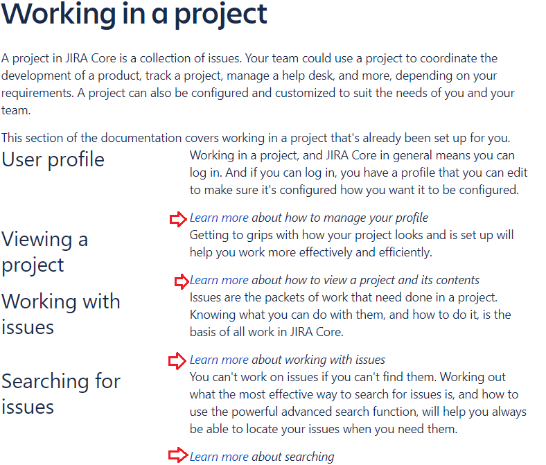

# Flare
description description description

| Pros | Cons |  
| -----|----- |  
| 1. ..|1... | 
| 2. ..|2... |

# **Comparison and summary**

Table of Contents
- [**Pros-and-cons of Confluence, Jira and Flare documentation**](#pros-and-cons-of-confluence-jira-and-flare-documentation)
- [Confluence](#confluence)
- [Jira](#jira)
- [Flare](#flare)
- [**Comparison and summary**](#comparison-and-summary)

